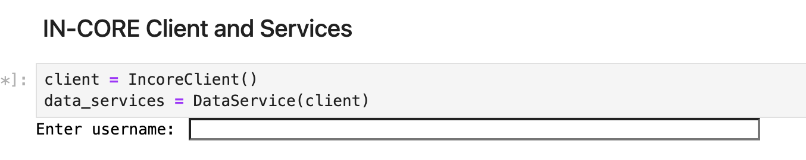

# Community Resilience Research Using IN-CORE - Case Study with 2011 Tornado Event at Joplin, MO 

**Authors**:

- Chen Wang <cwang138@illinois.edu> *
- Jong S. Lee <jonglee1@illinois.edu> *
- Chris Navarro <cmnavarr@illinois.edu> *
- Rashmil Panchani <rmp6@illinois.edu> *
- Yong Wook Kim <ywkim@illinois.edu> *
- Ya-Lan Yang <ylyang@illinois.edu> *
- Rob Kooper <kooper@illinois.edu> *
- Vismayak Mohanarajan <mohanar2@illinois.edu> *
- Wanting (Lisa) Wang <Lisa.Wang@colostate.edu> †
- Lisa Watkins <watkinsl@illinois.edu> *

**Affiliation**:
Authors marked with * are affiliated with the [National Center for Supercomputing Applications](https://www.ncsa.illinois.edu/), [University of Illinois at Urbana-Champaign](https://illinois.edu/).
Authors marked with † is affiliated with [Colorado State University](https://www.colostate.edu/).

---

Note: This repository contains the submission materials for the US-RSE’24 conference regarding the IN-CORE (Interdependent Networked Community Resilience Modeling Environment) platform. It demonstrates the application and capabilities of IN-CORE for assessing community resilience with a real-world case study on 2011 EF-5 Tornado at Joplin, Missouri.

### Abstract

Community resilience research is essential for anticipating, preventing, and mitigating the impacts of natural and anthropogenic disasters. To support this research, the [Center for Risk-Based Community Resilience Planning](http://resilience.colostate.edu/), funded by the [National Institute of Standards and Technology (NIST)](https://www.nist.gov/), developed the measurement science and metrics that can help communities in planning, adapting and recovering from disasters. This measurement science is implemented on an open source platform called the [Interdependent Networked Community Resilience Modeling Environment (IN-CORE)](https://incore.ncsa.illinois.edu/). On IN-CORE, users can run scientific analyses that model the impact of natural hazards and community resilience against these impacts.

This Jupyter Notebook uses the Joplin, MO community and the historical 2011 EF-5 Tornado event as an example of how to use IN-CORE to analyze community resilience. The city of Joplin, Missouri, USA, was hit by an EF-5 
tornado on May 22, 2011 ([NIST Report](https://nvlpubs.nist.gov/nistpubs/NCSTAR/NIST.NCSTAR.3.pdf)). Note that 
IN-CORE supports various hazards including earthquake, tornado, tsunami, flood, and hurricane.

The notebook includes analyses of structural damage to buildings, electric power network damage, building functionality, 
economic impact on the community, population dislocation, household recovery, and retrofit options for buildings. 
It also demonstrates how to visualize the results of these analyses. These analyses are powered by pyIncore, a Python 
client for IN-CORE, which provides a high-level interface for interacting with IN-CORE services, 
offering specific models (e.g., representing a tornado) and ensuring a consistent and controlled interface.

Lastly, the core logic of this notebook is used to power the [IN-CORE Community Resilience Playbook](https://incore.ncsa.illinois.edu/playbook/joplin/), an interactive guide
for community resilience planning. It has been used in workshops with the city planners and government officials, making it a valuable resource for resilience planning.

---

### Instructions

#### Register an IN-CORE account

Access to the IN-CORE service requires a user account. Registering for an account is free and open to everyone.
This account gives you access to all of the public data on the system and allows you to create data that is only
accessible by you. If applicable, it is recommended that you sign up with your institutional email.
To register for an account, please go to:

[Registration Link](https://incore.ncsa.illinois.edu/auth/realms/In-core/protocol/openid-connect/registrations?client_id=react-auth&response_type=code&scope=openid&redirect_uri=https://incore.ncsa.illinois.edu/)


#### Install pyIncore and related packages

1. **Update Conda** (if already installed):
    ```sh
    conda update conda
    ```

2. **Install Miniconda** (if not already installed):

    Download the latest Miniconda3 installer from the [Miniconda web page](https://docs.conda.io/en/latest/miniconda.html).

3. **Add Conda-Forge Channel**:
    ```sh
    conda config --add channels conda-forge
    ```

4. **Create Python Environment**:
    ```sh
    conda create -n pyincoreEnv python=3.9
    ```

5. **Activate Environment**:
    ```sh
    conda activate pyincoreEnv
    ```

6. **Install pyIncore and pyIncore-viz**:
    ```sh
    conda install -c in-core pyincore pyincore-viz
    ```

   If you have trouble installing pyincore and pyincore-viz, or it is taking a long time to resolve the dependencies, try using the libmamba solver by running the following command:
    ```sh
    conda install -c in-core pyincore pyincore-viz --solver=libmamba
    ```

7. **Install pyIncore-data** (optional): This package is not used in the submitted notebook.
    ```sh
    conda install -c in-core pyincore-data
    ```
   If you have trouble installing pyincore-data, or it is taking a long time to resolve the dependencies, try using
   the libmamba solver by running the following command:
    ```sh
    conda install -c in-core pyincore-data --solver=libmamba
    ```

9. **Specify Version** (if needed):
    ```sh
    conda install -c in-core pyincore=1.18.1
    ```

10. **Install Jupyter Notebook**:
    ```sh
    conda install jupyter
    ```

### Running Jupyter Notebook

1. **Start Jupyter Notebook**:
    ```sh
    jupyter notebook
    ```

2. **Open Notebook**:
   Open the notebook `in-core_joplin_case_study.ipynb` in your browser. If it doesn't open automatically,
   copy/paste the token provided in the terminal into your browser's navigation bar.

3. **Connect to IN-CORE**
   When running the notebook, you will encounter the IN-CORE client instantiation. You will be prompted to provide your IN-CORE username and password.


For more information, visit:

- [pyincore on Anaconda](https://anaconda.org/IN-CORE/pyincore)
- [pyincore-viz on Anaconda](https://anaconda.org/IN-CORE/pyincore-viz)

### Additional Resources

- For more information, please refer to
  IN-CORE’s [Frequently Asked Questions (FAQ)](https://incore.ncsa.illinois.edu/doc/incore/faq.html)
  and [Manual](https://incore.ncsa.illinois.edu/doc/incore/index.html).
- You can explore other example Jupyter Notebooks and learn more about the project on
  the [IN-CORE GitHub page](https://github.com/IN-CORE).
- For real-time support and to engage with other users, join our Slack community:
    - Slack Channel: [IN-CORE Slack](https://in-core.slack.com/)
    - Invitation: [Join IN-CORE Slack](https://join.slack.com/t/in-core/shared_invite/zt-25zffgnae-h0v8uGjpSli1YYp0Ypr68Q)
- Subscribe to the IN-CORE mailing list to receive the latest release information: <incore-dev@lists.illinois.edu>
